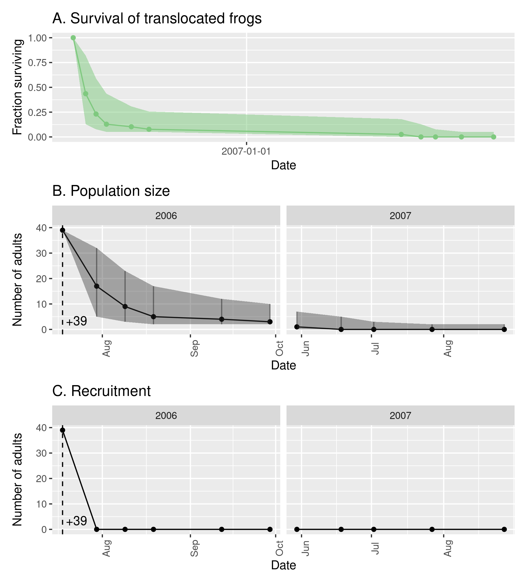
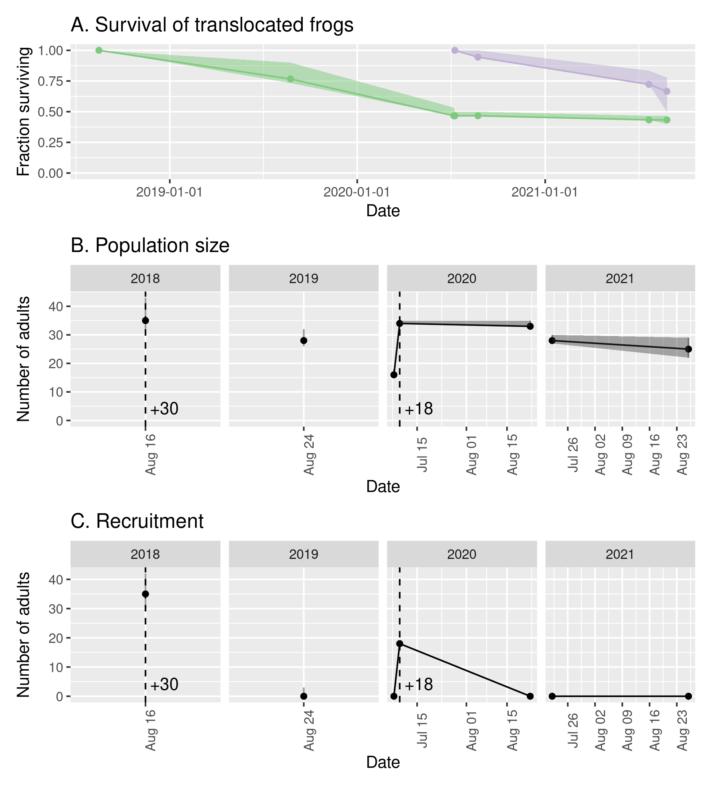
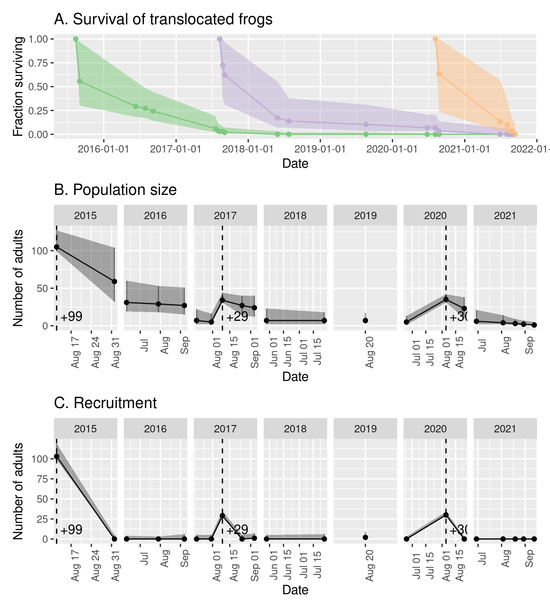

## Overview
This notebook contains a summary of results obtained from the analysis of capture-mark-recapture (CMR) data from mountain yellow-legged frog populations in California's Sierra Nevada.
These data are collected by the [Mountain Lakes Research Group](https://mountainlakesresearch.com), usually on an annual basis. 
The intent of this notebook is to provide a single file where researchers and managers can obtain information about the current status of these populations, many of which are critically important for the recovery of this species. 
Data from visual encounter surveys are also included in the summary to augment the results from CMR surveys. 
This information is updated annually as data from the most recent summer field season is analyzed. 

In the following summary, populations are categorized as "Donor populations", "Translocated populations", and "Reintroduced populations", and within these categories populations are identified by their five-digit site id. 

## Donor populations

## Translocated populations

### 70134

#### Survival
* Very low 1-year survival of the 2006 cohort of translocated frogs (0.12). Only six adults seen in 2007 and none thereafter.
* *T. elegans* never seen at site, so likely not responsible for low survival. 

#### Reproduction
* No evidence of reproduction was ever seen. 

{width=75%}

### 70414

#### Survival
* Very low 1-year survival of the 2006 cohort of translocated frogs (0.01), and no adults seen in 2007.
* Number of *T. elegans* appeared to increase markedly following translocation, may have been at least partially responsible for low survival. 

#### Reproduction
* No evidence of reproduction was ever seen. 

### 70556

#### Survival
* Relatively high 1-year survival of the 2018 cohort of translocated frogs (0.73). 
* Survival of 2020 cohort of translocated frogs was lower, but still high (0.61).
* Not as high as 74976 despite both sites receiving frogs from same donor population and in the same two years. 

#### Reproduction
* Successful reproduction occurred in 2019 (based on 2nd-year tads seen in 2020), 2020 (1st-year tads), and 2021 (1st-year tads). 
* 2019 cohort was not seen until 2020 (07-07) and was made up of only ~15 tadpoles. 
Suggests limited reproduction in 2019 and/or low survival during 2019-2020 winter. 
* 2020 cohort contained at least 425 individuals, based on count conducted on 08-23. 
Tadpole count on 2021-07-22 indicated 350 second-year animals, suggesting high overwinter survival of first-year tadpoles compared to that shown by 2019 cohort (perhaps due to light 2020 snow year --> long 2020 summer --> large tadpole size going into 2021 winter). 
* 2021 cohort contained approximately 435 individuals, based on count conducted on 2021-08-26. 
* First metamorphs seen in 2021 (1 on 07-22 and 13 on 08-26), small numbers likely due to small size of the 2019 cohort. 
Expect a substantially larger number of metamorphs in 2022 from 2021 cohort. 

#### Recruitment
* As expected for this high elevation site, no recruitment of new adults has occurred yet. 
* Unlikely that metamorphs in 2021 will grow to adult size by 2022, so recruitment may not be observed until 2023. 

#### Population size 
* 2021 estimated population size is approximately 25 adults. 
* All adults seen in northern 1/3 or 1/2 of lake. 

### 70619

#### Survival
* 1-year survival of the 2008 cohort is low (0.22). 
* As seen at other sites, despite lack of gartersnakes, population declined substantially during summer 2008 following translocation. Mortality caused by Bd? Poor-quality habitat?

#### Reproduction
* Tadpoles seen during most surveys conducted after 2011, but always in relatively small numbers (&le 25). No obvious basking habitat for tadpoles in lake due to steeply sloped littoral zone dominated by large boulders. Subadults seen occasionally. 

#### Recruitment
* Only evidence of recruitment was in 2019 when four untagged and relatively small adults were captured and tagged. 

#### Population size
* Estimated population size declined relatively rapidly during summer 2018, and since 2012 has been near zero. 

### 70628

#### Survival
* 1-year survival of the 2020 cohort is 0.65. 
Seems quite high for frogs from the 72996 donor population. 

#### Reproduction
* No tadpoles seen during the 2021-08-10 VES, but hopefully will be observed during surveys in 2022. 

#### Recruitment
* No recruitment expected until at least 2024. 

#### Population size
* 2021 estimated population size is approximately 17 adults

### 70641

#### Survival
* The three translocated cohorts (2015, 2017, 2020) have all shown low 1-year survival (0.27, 0.16, 0.07, respectively). 
* Gartersnakes present at site, but within months of translocation frogs grow to large sizes that provide a refuge from predation. 
* Frogs at this site grow quickly and attain large sizes (up to 82 mm SVL - in 2021)

#### Reproduction
* Reproduction in this population is difficult to assess because non-adult life stages are rarely seen due to thick littoral zone vegetation.
* No tadpoles have been observed during VES, and the only subadult observed was in 2019.
* However, new adult recruits have been captured, so some reproduction is obviously occurring. 

#### Recruitment
* A total of 4 new (untagged) frogs have been captured, including 1 in 2017, 2 in 2019, and 1 in 2020. 

#### Population size
* The 2021 estimated population size is near 0. 

### 74976

#### Survival
* Unusually high 1-year survival of the 2018 cohort of translocated frogs (0.94). 
* Survival of 2020 cohort of translocated frogs was lower, but still high (0.67).

#### Reproduction
* Successful reproduction (as evidenced by first-year tadpoles) observed in 2019, 2020, and 2021. 
* 2019 cohort contained at least 250 individuals, based on count conducted on 09-Sep-2019. 
Cohort appeared to experience relatively low overwinter survival (perhaps due to the heavy 2019 snow year --> short 2019 summer --> small tadpole size going into 2020 winter), with approximately 25 second-year tadpoles counted on 20-Aug-2020. 
5 metamorphs seen during the August 2020 CMR. 
* 2020 cohort contained at least 320 individuals, based on count conducted on 20-Aug-2020. 
Tadpole count on 25-Jun-2021 indicated 386 second-year animals, suggesting high overwinter survival of first-year tadpoles compared to that shown by 2019 cohort (perhaps due to light 2020 snow year --> long 2020 summer --> large tadpole size going into 2021 winter). 
* 2021 cohort contained at least 305 individuals, based on count conducted on 18-Aug-2021. 
* Many subadults counted during mid-August 2021 survey (203), compared to very few in late-summer 2020. 

#### Recruitment
* First new recruits into the adult population (5) captured during mid-August 2021 CMR survey. 
Likely all from 2019 cohort, but large size range (41-50 mm) suggests that these adults were from animals that metamorphosed in both late-summer 2020 and early-summer 2021. 

#### Population size
* 2021 estimated population size is approximately 28 adults. 
* As of mid-August 2021, frog population extends from Lower Pool outlet to 72973. 
* 72973 (uppermost pond) was colonized by adults and metamorphs in 2020. 
* All reproduction is occurring in 74976. 
* Population seems likely to become firmly established in next few years. 

## Reintroduced populations

