## Overview

This notebook contains a summary of results obtained from the analysis of capture-mark-recapture (CMR) data from mountain yellow-legged frog populations in California's Sierra Nevada.
These data are collected by the [Mountain Lakes Research Group](https://mountainlakesresearch.com), usually on an annual basis.
The intent of this notebook is to provide a single file where researchers and managers can obtain information about the current status of these populations, many of which are critically important for the recovery of this species.
Data from visual encounter surveys are also included in the summary to augment the results from CMR surveys.
This information is updated annually as data from the most recent summer field season is analyzed.

In the following summary, populations are categorized as "Donor populations", "Translocated populations", and "Reintroduced populations", and within these categories populations are identified by their five-digit site id.
Unless otherwise noted, frogs in all populations are infected with the amphibian chytrid fungus, *Batrachochytrium dendrobatidis* (Bd).
Unlike the severe effects caused by Bd following its initial arrival in these populations, usually decades ago, many of these populations are now co-existing with Bd.
The reasons for this changed dynamic are under study, and appear to involve evolutionary changes in frogs that have made them less susceptible to chytridiomycosis, the disease caused by Bd.

## Donor populations

"Donor" populations include populations from which frogs are collected for translocations and in which CMR-based estimates of survival guide decisions on how many frogs can be collected without impacting population viability. This category also includes populations that are not used as donor populations, but are particularly important because of unique characteristics such as remaining in a Bd-naive condition. Given the paucity of information about Bd-naive populations, CMR surveys could provide important insights into frog dynamics in the absence of Bd infection. 

### 11009
Unlike nearly all other populations at which CMR surveys are being conducted, this population is Bd-naive. The objective of the surveys at this site is to describe the population dynamics of MYL frogs in the absence of Bd infection. This population was chosen for surveys because the small size of the habitat produced a relatively small population at which CMR would likely be feabible (unlike the populations in larger lakes, that often contain thousands of adult frogs). No translocations/reintroductions have been conducted to this site, so no estimates of frog survival are produced by the mrmr package. 

This site contains two ponds (11008, 11009) located within 50 m of each other. Both ponds have similar area and depth. However, throughout the summer the upper pond (11008) appears to drain via subsurface flow to the lower pond (11009). As a result, the surface elevation of 11008 typically drops by ~ 50 cm over the summer while the elevation of 11009 stays constant. That contributes to a relatively rocky and unvegetated shoreline at 11008 and one at 11009 that is dominated by sphagnum moss, often creating overhanging banks that are highly preferred habitat of MYL frogs. This habitat difference results in very different population structures at the two sites. 11008 typically contains a small adult population of ~ 20 large adult frogs, and 11009 typically contains a much larger population (~ 100-200 adults). Both ponds contain similar numbers of tadpoles (~ 500-1000). 

#### Reproduction
* Relatively large numbers of tadpoles are observed in both ponds during every survey conducted since the first VES in 2000-2003.  

#### Recruitment
* Patterns of recruitment are not yet evident because since CMR surveys began in 2019 it has taken until 2021 to get most adults tagged.  

#### Population size
* The estimated population size across both ponds is ~ 600 adults, and the population has been relatively stable since CMR surveys began in 2019.  

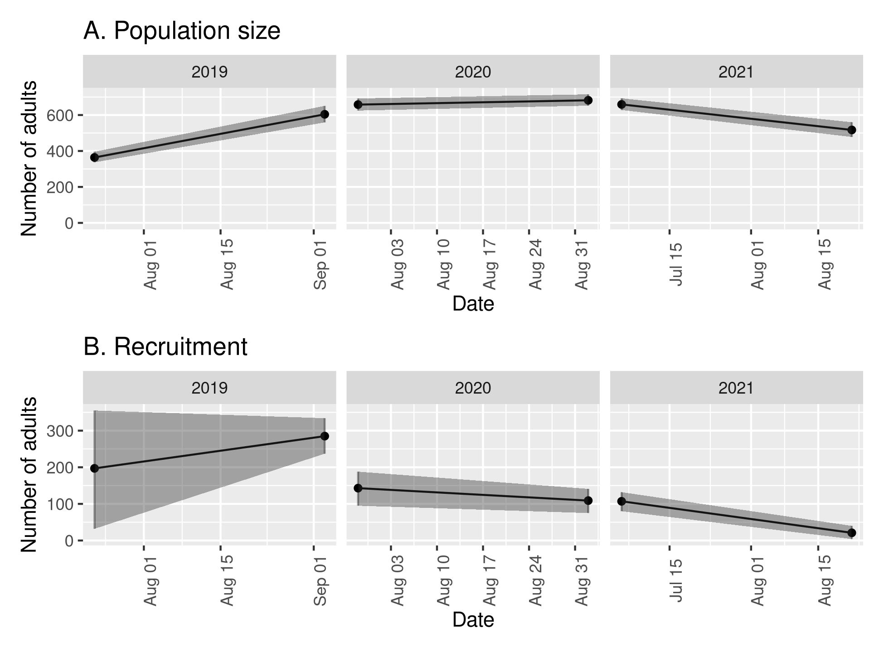{width=75%}

### 50783

#### Reproduction
* VES is not conducted at this stream/meadow site due to relatively low detectability of all life stages. However, tadpoles are observed in the breeding area every year. Tadpoles are collected from the breeding area every year for rearing in captivity, and resulting adult frogs are reintroduced into nearby suitable habitats. 

#### Recruitment
* Since CMR surveys began in 2018, patterns of recruitment at this site suggest a modest number of new adults entering the adult population every year (~ 25 per primary period).  

#### Population size
* The estimated number of adults has been remarkably stable since 2018 , at ~ 220-270. The largest number of adults estimated to date was in 2021. 

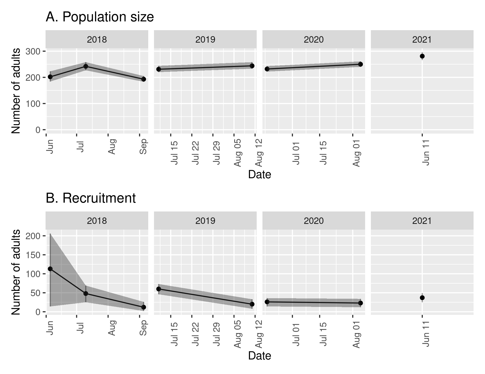{width=75%}

### 72808

This site includes two adjacent and relatively small, shallow ponds (72808, 72336) connected by a perennial stream.  that is exposed to large avalanches during severe winters. These events typically cause very high mortality of adults and resulting high variability in frog population size (~ 50-250). We anticipated collecting adult frogs from this population in 2017 for a translocation, but avalanche impacts during the previous winter produced high frog mortality and the resulting small population size precluded any frog collections. It is hoped that the population will rebound and be able to serve as a donor population in the future.  

#### Reproduction
* Tadpoles have been observed during every VES conducted since 2001. The upper pond (72808) typically contains a larger number of tadpoles (up to 400 during VES), with VES at the lower pond (72336) typically being < 50. However, the 2021 VES count at 72336 were unusually high (~ 150) and 3x higher than at 72808.  

#### Recruitment
* Recruitment was very high in 2015 and 2016, following several relatively mild winters. This recruitment corresponded with a rapidly increasing population size. Following the avalanche-caused mortality during the 2016-2017 winter there has been little recruitment. Following the metamorphosis of the surviving tadpoles in 2018, there was been no recruitment in 2019-2021.  

#### Population size
* The number of adults increased rapidly in 2015-2016, reaching an estimated population size of ~ 600 in 2016. Avalanche-caused mortality reduced the population size to ~ 200 in 2017 and with few or no tadpoles and little or no recruitment, the population has continued to decline. In 2021, the estimated population size was ~ 30 adults.  

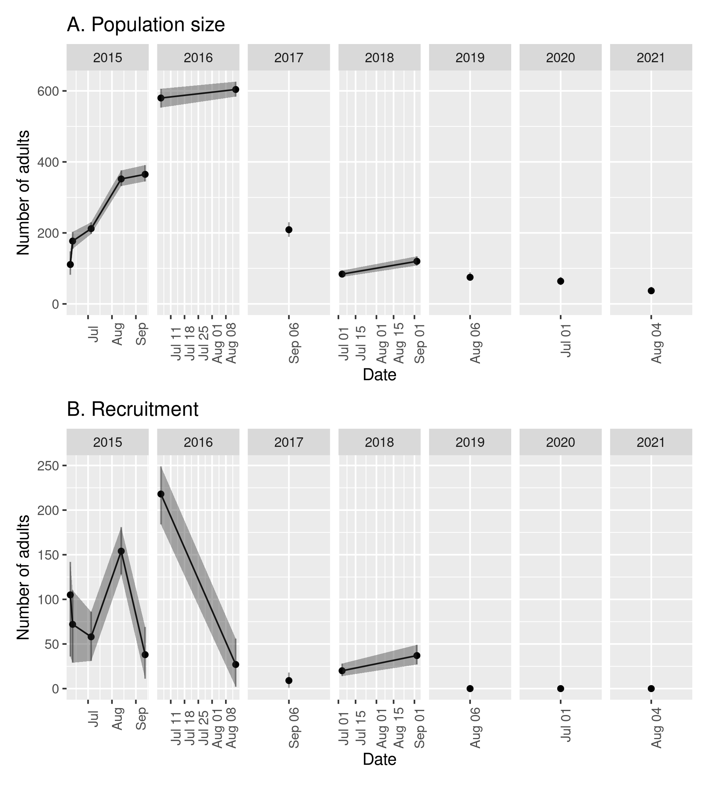{width=75%}

## Reintroduced populations

### 50785

This population was established via three reintroductions of adult *R. muscosa*, conducted in 2019, 2020, 2021. Frogs in all cohorts originated as tadpoles collected from 50783, and were raised at the Oakland Zoo. Frogs did not undergo "immune priming" prior to reintroduction due to staffing issues at the zoo. Reintroductions failed to establish a persistent population. 

#### Survival
* 1-year survival of the reintroduced 2019 cohort was relatively high (median = 0.45), but was 0 for the 2020 and 2021 cohorts.  This pattern corresponded with low Bd prevalence/load in 2019, but high prevalence/load thereafter. 

#### Reproduction
* Small numbers of tadpoles were observed in 2020 and 2021, but none were counted in 2022. 

#### Recruitment
* No recruitment of new frogs into the adult population occurred through 2022. 

#### Population size
* Frogs from the 2019 cohort persisted through summer 2019 and early-summer 2020, but were largely gone by late-summer 2020. Frogs in the 2020 and 2021 cohorts declined to zero in the first summer. 

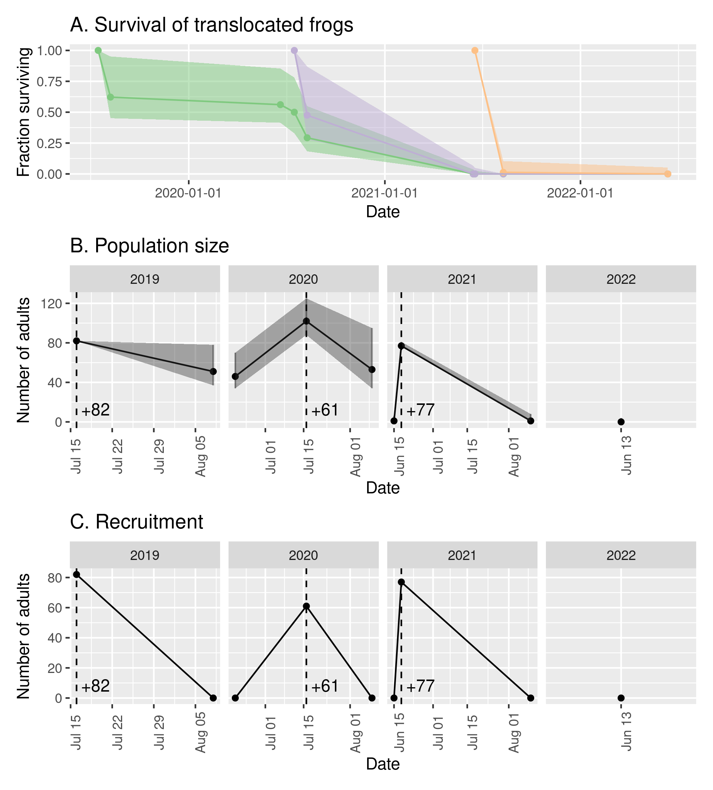{width=75%}

## Translocated populations

### 10486

This population was established via translocation of 60 adults in 2016. This action was conducted by the National Park Service to create another population in a basin that contains several Bd-naive populations. The translocated frogs were not PIT tagged before release, and were monitored occasionally by NPS staff using VES. CMR surveys were initiated in 2020. The objective is to provide insights into the population dynamics of translocated frog populations in the absence of Bd infection, for comparison to dynamics of Bd-positive translocated populations. 

#### Survival
* Because translocated frogs were not PIT tagged, no survival estimates are possible.  

#### Reproduction
* Approximately 50-170 tadpoles were counted during VES in 2020 and 2021. There is very limited shallow-water basking habitat in this high elevation lake.  

#### Recruitment
* Judging by the relatively large size of most captured untagged frogs at this site (60-74 mm), the majority likely are the originally translocated individuals. However, 8 frogs were 46-55 mm and those are almost certainly new recruits. 

#### Population size
Estimated population size is ~ 35-40 adult frogs. In the absence of much recruitment yet to date, this suggests relatively high survival of the translocated frogs. 

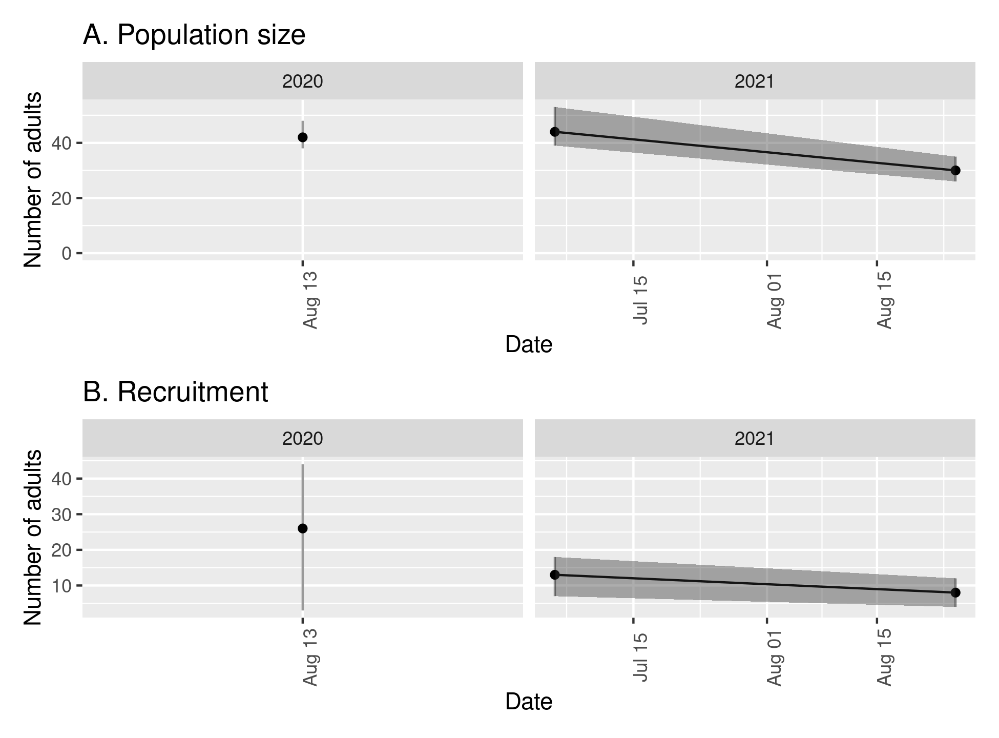{width=75%}

### 70134

#### Survival

-   Very low 1-year survival of the 2006 cohort of translocated frogs (0.12). Only six adults seen in 2007 and none thereafter.
-   *T. elegans* never seen at site, so are likely not responsible for low survival.

#### Reproduction

-   No evidence of reproduction was ever seen.

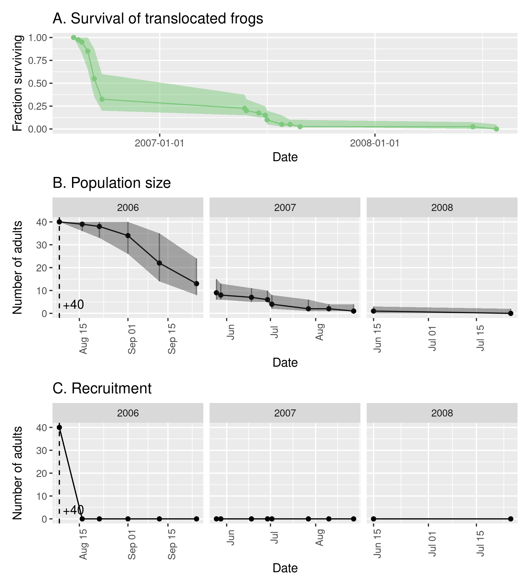{width=75%}

### 70370

#### Survival

-   Very low 1-year survival of both the 2016 and 2018 translocated cohorts (0.04 and 0.17, respectively).
-   Habitat looks very good for *R. sierrae* for both summer and winter, so it remains unclear what the factor limiting frog survival at this site is. It is unlikely related to winter oxygen levels in the water because trout thrived here for decades.

#### Reproduction

-   No evidence of reproduction was ever observed.

#### Population size

-   Population size returned to near-zero within one year of each translocation.
-   The absence of any frogs during the 2020 survey suggests that the population is extirpated.

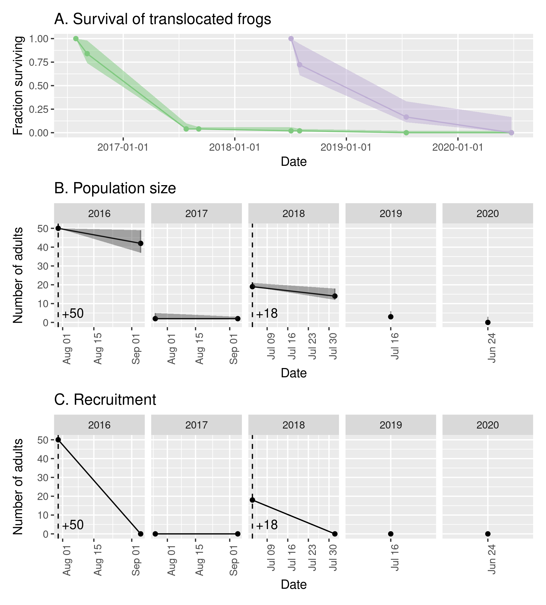{width=75%}

### 70413

#### Survival

-   Relatively high 1-year survival of the 2013, 2015, and 2017 cohorts of translocated frogs (0.69, 0.64, 0.56, respectively).

#### Reproduction

-   Egg masses, tadpoles, and/or subadults have been observed annually starting in 2014, with a maximum count summed across all sites of 800 in 2015.
-   Subadults were first observed in 2015 and are always seen in relatively low numbers (maximum count = 27).

#### Recruitment

-   Recruitment of new adults was first observed in 2016, and has occurred in all years since.
-   Number of new recruits seems quite regular, with 20, 15, and 24 recruits tagged in 2018, 2020, and 2021, respectively.

#### Population size

-   From 2017 to early-2021 (i.e., prior to translocation and reintroduction of 117 frogs), estimated population size across all sites was stable at approximately 50 adults in each year.
-   This population, although still relatively small given the abundant high quality habitat, appears well-established and self-sustaining.
-   The 2021 translocation and reintroduction is likely to substantially increase the population size.

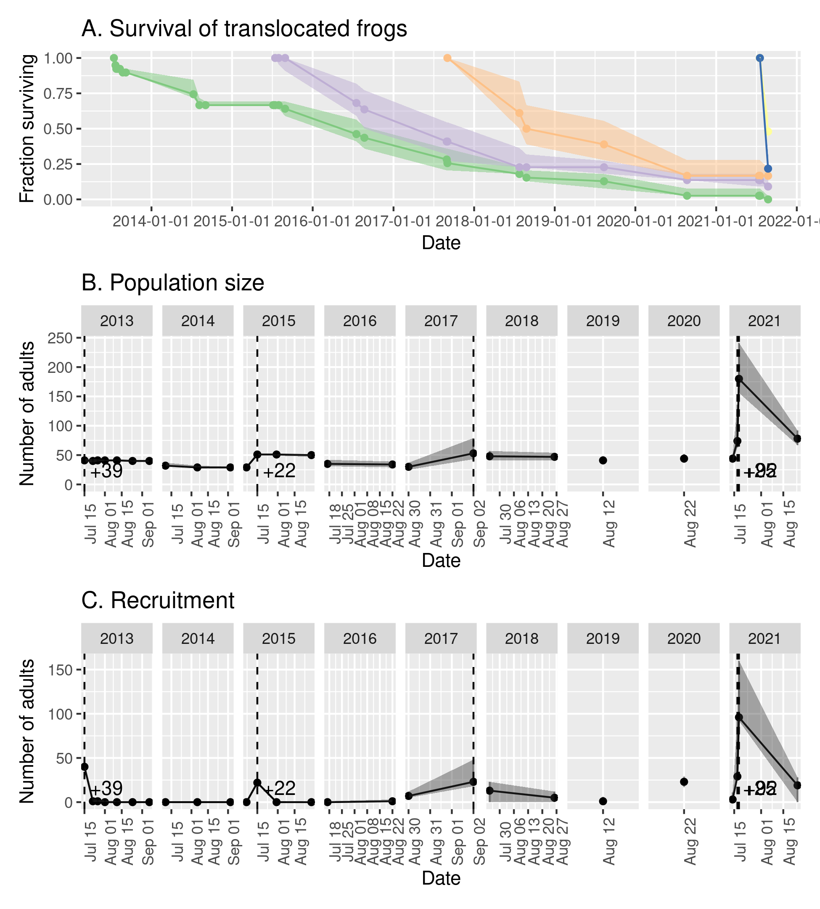{width=75%}

### 70414

#### Survival

-   Very low 1-year survival of the 2006 cohort of translocated frogs (0.01), and no adults seen in 2007.
-   Number of *T. elegans* appeared to increase markedly following translocation, may have been at least partially responsible for low survival.

#### Reproduction

-   No evidence of reproduction was ever seen.

{width=75%}

### 70449

#### Survival

-   Intermediate level of survival of the 2014 cohort of translocated frogs (0.35).
-   Survival of the 2017 cohort of translocated frogs was somewhat higher (0.53).
-   More frogs found dead at this site than is typically the case at other sites. Whether this is due to site characteristics (e.g., lack of hiding cover) that make carcasses easier to detect, or population characteristics (i.e., relatively low survival) is unknown.
-   Adult frogs at this site commonly feed on HYRE tadpoles and subadults and are very well-fed. It would be interesting to know whether these frogs grow quickly but have short life spans compared to frogs at higher elevations.

#### Reproduction

-   Egg masses, tadpoles, and/or subadults have been observed annually since 2015, but always in relatively small numbers (maximum count = 80 tadpoles).
-   The relatively low numbers are likely due to high habitat complexity and the fact that at this elevation tadpoles often do not aggregrate near shore.

#### Recruitment

-   Recruitment of new adults has occurred in most years since 2016, with a maximum number of 15 in 2016.
-   Substantial recruitment occurred in 2016, just two years after the first translocation. This indicates that at this relatively low elevation site, the transition from egg to adult can occur in only 1.5 years.
-   Recruitment does not appear to be particularly episodic, in contrast to what is observed at some other sites.

#### Population size

-   Population appears to have stabilized at 20-25 adults. Although smaller than hoped for, this may be a typical population size at this elevation due to predation from snakes and invertebrate predators.

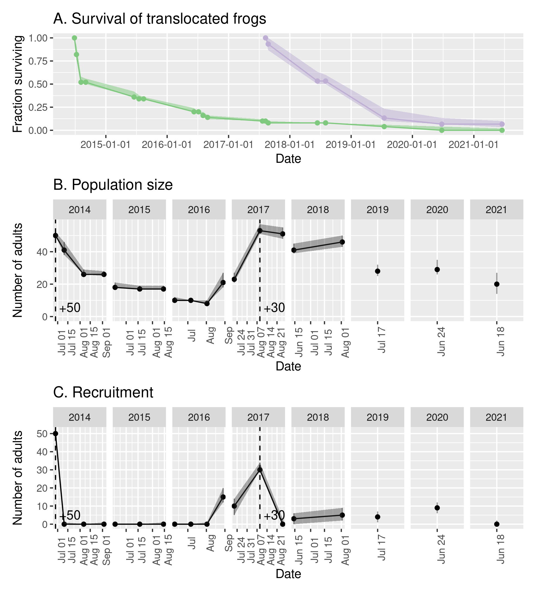{width=75%}

### 70505

#### Survival

-   Low 1-year survival of the 2008, 2013, 2015, and 2017 cohorts of translocated frogs (0.19, 0.16, 0.10, 0.10).

#### Reproduction

-   Tadpoles and/or subadults seen in every year starting in 2010.
-   Counts of these life stages are generally low (\< 25), but the 200 tadpoles counted in 2018 were an obvious exception.

#### Recruitment

-   First new recruits into the adult population were observed in 2012.
-   Some recruitment of new adults occurred in most years, including 12-17 recruits per year in 2013, 2014, and 2015.

#### Population size

-   Estimated population size in the last survey year (2018) was approximately 6 adults.
-   This small population size is likely due to survival of adults being low enough to preclude population growth, even with 4 translocations and natural recruitment of adults in several years.
-   Available evidence suggests that, at best, this site will support only a small frog population, and conducting additional translocations will likely not alter that outcome.

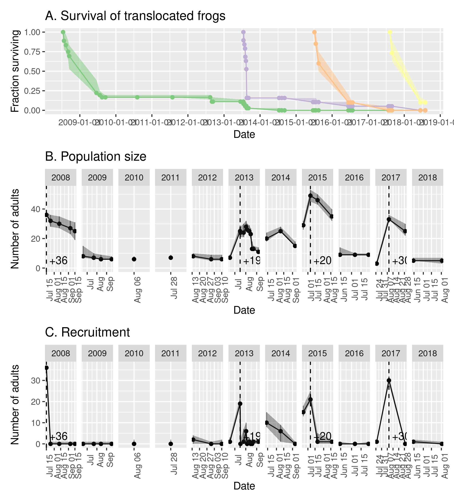{width=75%}

### 70550

#### Survival

-   Relatively high 1-year survival of the 2006 cohort of translocated frogs (0.61).
-   Survival of 2013 cohort of translocated frogs was substantially lower (0.29).

#### Reproduction

-   Tadpoles and subadults were first observed in 2008.
-   Both life stages were observed in all subsequent surveys (2008-2021), and in much higher numbers than in any other translocated population.
-   Since 2016, tadpole counts from visual encounter surveys have often exceeded 1500 individuals.

#### Recruitment

-   The first recruit into the adult population was observed in 2010, and except for 2011, new recruits have been tagged in every subsequent year (2010, 2012-2021).
-   Recruitment magnitude is highly variable between years, with notably large recruitment events in 2016 and 2021, and lower but substantial recruitment in several additional years (2013, 2014, 2018, 2020).
-   This variation may result from an interaction between subadult survival, Bd infection, and winter severity.

#### Population size

-   Following the original translocation in 2006, the estimated population was \< 50 adults until 2013. During 2013-2015, the population increased to 100-150 adults. Since the large recruitment event in 2016, the population has fluctuated between 170 and 420 adults, with an average population size of approximately 250 adults.
-   This population is now well-established, and is large enough to serve as a donor of frogs for future frog recovery actions.
-   The 16-year mark-recapture dataset has allowed unprecedented insights into the dynamics of population establishment. It is also allowing us to test hypotheses regarding the drivers of the observed population dynamics, information that is critical for the design and implementation of future frog recovery actions.

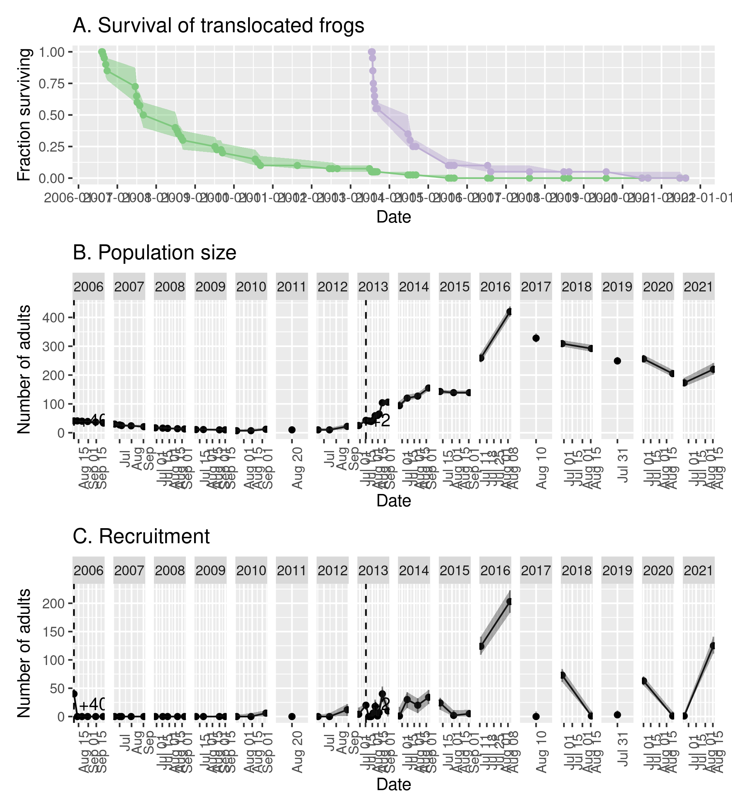{width=75%}

### 70556

#### Survival

-   Relatively high 1-year survival of the 2018 cohort of translocated frogs (0.73).
-   Survival of 2020 cohort of translocated frogs was lower, but still high (0.61).
-   Not as high as 74976 despite both sites receiving frogs from same donor population and in the same two years.

#### Reproduction

-   Successful reproduction occurred in 2019 (based on 2nd-year tads seen in 2020), 2020 (1st-year tads), and 2021 (1st-year tads).
-   2019 cohort was not seen until 2020 (07-07) and was made up of only ~ 15 tadpoles. Suggests limited reproduction in 2019 and/or low survival during 2019-2020 winter.
-   2020 cohort contained at least 425 individuals, based on count conducted on 08-23. Tadpole count on 2021-07-22 indicated 350 second-year animals, suggesting high overwinter survival of first-year tadpoles compared to that shown by 2019 cohort (perhaps due to light 2020 snow year --\> long 2020 summer --\> large tadpole size going into 2021 winter).
-   2021 cohort contained approximately 435 individuals, based on count conducted on 2021-08-26.
-   First metamorphs seen in 2021 (1 on 07-22 and 13 on 08-26), small numbers likely due to small size of the 2019 cohort. Expect a substantially larger number of metamorphs in 2022 from 2021 cohort.

#### Recruitment

-   As expected for this high elevation site, no recruitment of new adults has occurred yet.
-   Unlikely that metamorphs in 2021 will grow to adult size by 2022, so recruitment may not be observed until 2023.

#### Population size

-   2021 estimated population size is approximately 25 adults.
-   All adults seen in northern 1/3 or 1/2 of lake.

{width=75%}

### 70619

#### Survival

-   1-year survival of the 2008 cohort is low (0.22).
-   As seen at other sites, despite lack of gartersnakes, population declined substantially during summer 2008 following translocation. Mortality caused by Bd? Poor-quality habitat?

#### Reproduction

-   Tadpoles seen during most surveys conducted after 2011, but always in relatively small numbers (&le 25). No obvious basking habitat for tadpoles in lake due to steeply sloped littoral zone dominated by large boulders. Subadults seen occasionally.

#### Recruitment

-   Only evidence of recruitment was in 2019 when four untagged and relatively small adults were captured and tagged.

#### Population size

-   Estimated population size declined relatively rapidly during summer 2018, and since 2012 has been near zero.

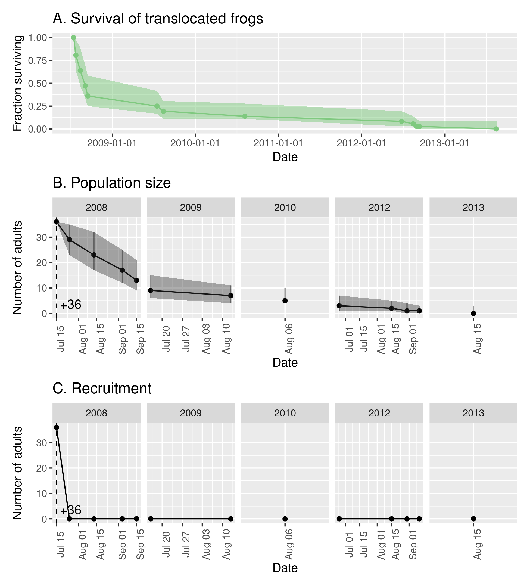{width=75%}

### 70628

#### Survival

-   1-year survival of the 2020 cohort is 0.65. Seems quite high for frogs from the 72996 donor population.

#### Reproduction

-   No tadpoles seen during the 2021-08-10 VES, but hopefully will be observed during surveys in 2022.

#### Recruitment

-   No recruitment expected until at least 2024.

#### Population size

-   2021 estimated population size is approximately 17 adults

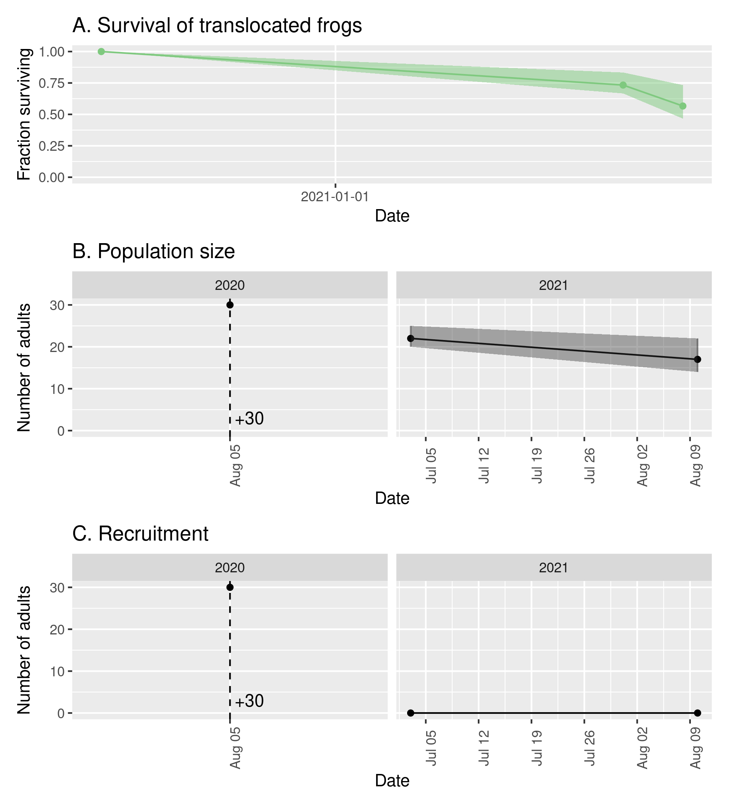{width=75%}

### 70641

#### Survival

-   The three translocated cohorts (2015, 2017, 2020) have all shown low 1-year survival (0.27, 0.16, 0.07, respectively).
-   Gartersnakes present at site, but within months of translocation frogs grow to large sizes that provide a refuge from predation.
-   Frogs at this site grow quickly and attain large sizes (up to 82 mm SVL - in 2021)

#### Reproduction

-   Reproduction in this population is difficult to assess because non-adult life stages are rarely seen due to thick littoral zone vegetation.
-   No tadpoles have been observed during VES, and the only subadult observed was in 2019.
-   However, new adult recruits have been captured, so some reproduction is obviously occurring.

#### Recruitment

-   A total of 4 new (untagged) frogs have been captured, including 1 in 2017, 2 in 2019, and 1 in 2020.

#### Population size

-   The 2021 estimated population size is near 0.

{width=75%}

### 74976

#### Survival

-   Unusually high 1-year survival of the 2018 cohort of translocated frogs (0.94).
-   Survival of 2020 cohort of translocated frogs was lower, but still high (0.67).

#### Reproduction

-   Successful reproduction (as evidenced by first-year tadpoles) observed in 2019, 2020, and 2021.
-   2019 cohort contained at least 250 individuals, based on count conducted on 09-Sep-2019. Cohort appeared to experience relatively low overwinter survival (perhaps due to the heavy 2019 snow year --\> short 2019 summer --\> small tadpole size going into 2020 winter), with approximately 25 second-year tadpoles counted on 20-Aug-2020. 5 metamorphs seen during the August 2020 CMR.
-   2020 cohort contained at least 320 individuals, based on count conducted on 20-Aug-2020. Tadpole count on 25-Jun-2021 indicated 386 second-year animals, suggesting high overwinter survival of first-year tadpoles compared to that shown by 2019 cohort (perhaps due to light 2020 snow year --\> long 2020 summer --\> large tadpole size going into 2021 winter).
-   2021 cohort contained at least 305 individuals, based on count conducted on 18-Aug-2021.
-   Many subadults counted during mid-August 2021 survey (203), compared to very few in late-summer 2020.

#### Recruitment

-   First new recruits into the adult population (5) captured during mid-August 2021 CMR survey. Likely all from 2019 cohort, but large size range (41-50 mm) suggests that these adults were from animals that metamorphosed in both late-summer 2020 and early-summer 2021.

#### Population size

-   2021 estimated population size is approximately 28 adults.
-   As of mid-August 2021, frog population extends from Lower Pool outlet to 72973.
-   72973 (uppermost pond) was colonized by adults and metamorphs in 2020.
-   All reproduction is occurring in 74976.
-   Population seems likely to become firmly established in next few years.

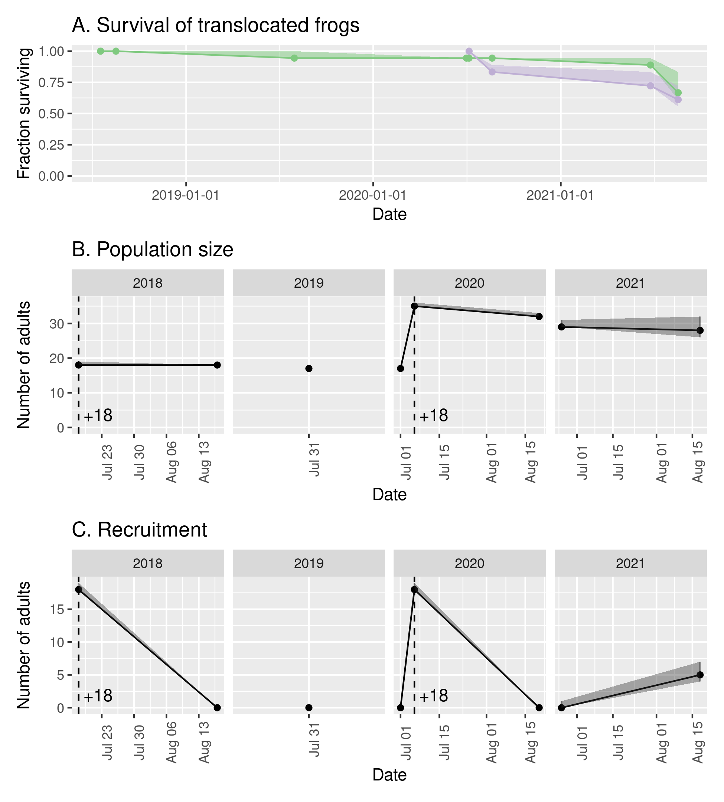{width=75%}

